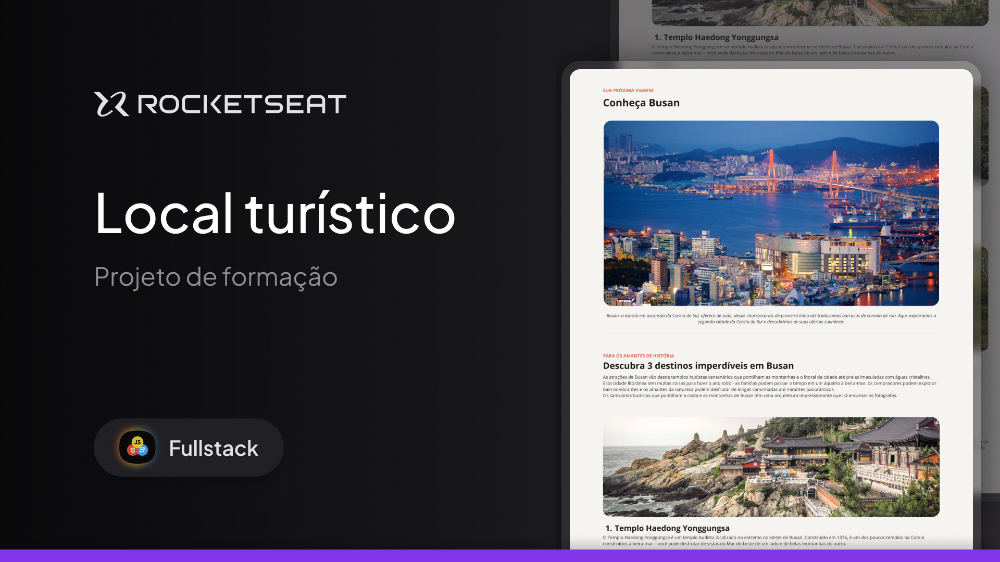

<h1 align="center">Desafio prático - Local Turístico</h1>

**Descrição breve do projeto**:

Boas-vindas ao Desafio prático - Local Turístico

Este projeto é uma página web desktop com informações sobre um local turístico .

Nessa aplicação eu trabalhei com:

- Estrutura HTML;
- Estilizações com CSS;
- Fontes;
- Espaçamentos;
- Imagens;
- Listas desordenadas;
- Alterações das cores dos textos;
- Alterações dos pesos dos textos;

---

## Índice

- [Visualização](#visualização)
- [Tecnologias Utilizadas](#tecnologias-utilizadas)
- [Licença](#licença)

---

## Visualização

🔗 [Clique aqui para acessar o site](https://caiovinicius-full-stack.github.io/Local-Turistico/)

---

## Tecnologias Utilizadas

HTML5: Estruturação do conteúdo.

CSS3: Estilização.

Git e GitHub: Controle de versão e hospedagem.
